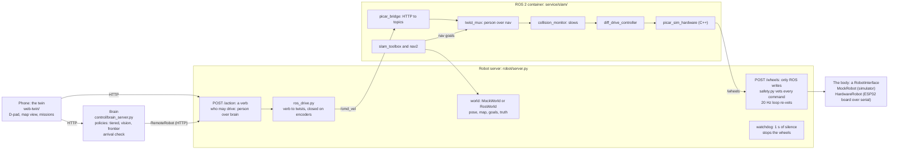
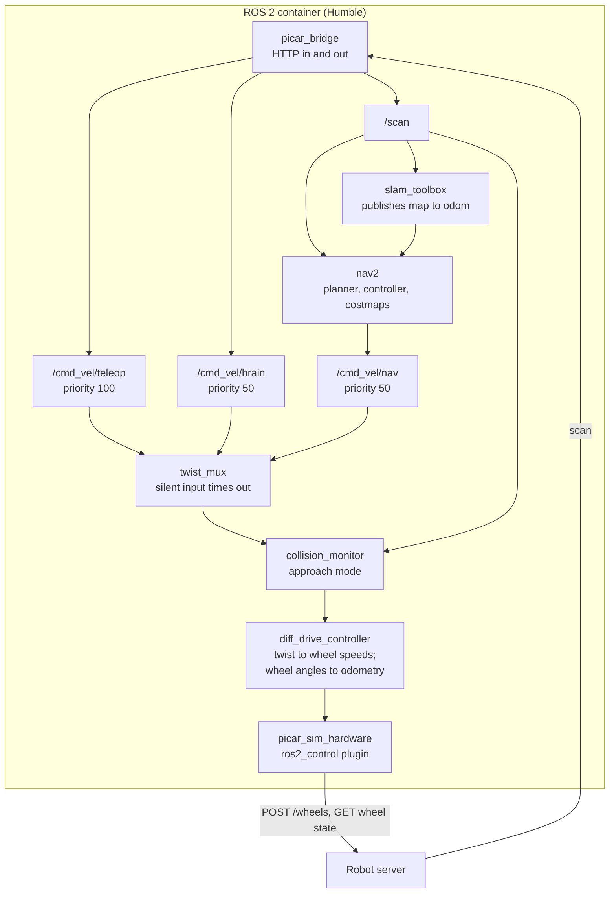

# Architecture overview

vision-picar is an indoor robot that finds things in a house. It is five
cooperating processes: a phone UI, a brain, a robot server, a ROS 2
container and a body. The code that drives the simulator today is the code
that will drive the car, so moving onto hardware is a config change.

This page is the map. Each component's own specification sits under
`docs/<domain>/` and is listed in the [index](README.md). The
`PLAN-*.md` documents at the repo root hold the dated history and every
measured number. This overview is adapted from the "ROS 2 for vision-picar"
explainer (checked against the repo on 2026-09-30) and re-checked on
2026-10-03.

## The system on one page

Every move goes from the phone or the brain to the robot server, through
ROS, back to the robot server, and only then to the body. The phone and the
brain speak **verbs** ("forward one move", "turn left 45 degrees"). ROS
speaks **velocities**. The robot server turns a verb into a stream of
velocity commands; ROS arbitrates and shapes them; they come back to the
robot server as wheel speeds, where the safety layer vets them one last
time before the body moves.

| Process | Owns | Never does |
|---|---|---|
| **Phone (the twin)** | Drawing what the servers report; the D-pad; starting missions | Decide anything |
| **Brain** | What to do next: a mission, its policy, its failsafes | Touch the body except through HTTP, so it can run on a laptop today and on the car later |
| **Robot server** | Safety, who is driving, the watchdog; the only process that touches the body | Plan routes or build maps |
| **ROS 2 container** | Velocity arbitration, wheel kinematics, map-building (SLAM), path planning (nav2) | Touch the body directly |
| **The body** | Wheels, encoders, camera, lidar: anything that implements `RobotInterface` | Know who is driving it |

ROS is **off by default in the simulator**: the twin works without Docker,
and the robot server then runs verbs straight through `robot/safety.py` to
the body ("direct" drive). On the car, ROS drive is to become the default
once its four gates pass (`PLAN-ros-alignment.md` 3.24; three are met, the
fourth needs the Jetson). Direct drive stays as the car's fallback if ROS
dies, and on the fallback only a person may drive.

## The four walls

Four rules have held throughout, and each is enforced by a test rather than
by memory. Together they are why hardware day is a config change.

1. **One abstraction for the body: `RobotInterface`** (`robot/interface.py`).
   The brain, the robot server and ROS never know whether they drive the
   simulator (`sim/mock_robot.py`) or the motor board
   (`robot/hardware_robot.py`). `robot/factory.py` is the only place that
   chooses. `tests/test_robot_contract.py` runs one conformance suite
   against every backend. Spec: [body](body/ARCHITECTURE.md).
2. **Body state and world state are separate.** Odometry is what the body
   says about itself and lives on `RobotInterface`. Pose and map are what
   the world says about the body and live on `WorldInterface`
   (`world/interface.py`). SLAM's pose can jump when the map corrects
   itself; odometry never does. `tests/test_world_contract.py` pins the
   split. Spec: [world](world/ARCHITECTURE.md).
3. **ROS stays inside its container.** Nothing outside `service/slam/` may
   import ROS (`tests/test_ros_containment.py`); everything else talks to it
   over HTTP. ROS is a component the project uses, not a framework it lives
   inside. Spec: [ros](ros/ARCHITECTURE.md).
4. **Safety sits in series, with the robot server last.** ROS's
   `collision_monitor` checks every command first, then `robot/safety.py`.
   Each can only slow or stop, never speed up, so they cannot disagree about
   what is allowed. Spec: [safety](safety/ARCHITECTURE.md).

**Rule 4 changed the hardware plan.** The original plan had a ROS plugin
talking to the motor board directly. That would have taken `robot/safety.py`
out of the navigation path and given one serial port two owners. Instead
the serial port belongs to `robot/hardware_robot.py`, a `RobotInterface`
backend like the simulator, and ROS keeps talking HTTP to the robot server
exactly as it does in the simulator (`PLAN-ros-alignment.md` 3.16).

## Where the line is

Robotics plumbing belongs inside ROS. Mission logic, the LLM, safety and
the phone stay outside. Plumbing means drivers, localisation and planning:
solved problems where ROS's packages beat anything the project would write.
Outside stays everything that makes this robot this robot, plus the one
piece that must keep working when ROS hangs.

| Piece | Runs | Belongs |
|---|---|---|
| Motor control, odometry (`diff_drive_controller`) | Inside ROS | Inside |
| SLAM (`slam_toolbox`), planning (nav2) | Inside ROS | Inside |
| Perception (detector + CLIP, `brain/perceive.py`) | Outside, in the brain | Outside for now; a candidate to move in |
| Mission logic, the LLM calls | Outside (the brain) | Outside |
| Safety veto (`robot/safety.py`), watchdog | Outside (the robot server) | Outside, always |
| The phone | Outside (HTTP) | Outside |

The line moves only when one of these shows up in data from the car: the
bridge grows into a copy of ROS's own interface; debugging needs one
recording of everything and matching logs across the wall is too hard; a
control loop needs a rate HTTP cannot carry; or GPU-accelerated perception
(NVIDIA's Isaac ROS packages, which ship as ROS nodes) is wanted on the
Jetson. Even then the wall moves rather than disappears: perception would go
in, and the brain would stay out.

## Inside the ROS container

Everything ROS lives in one Docker container, so the middleware's traffic
never crosses Docker's network. The container reaches the robot server over
HTTP and exposes one port back out: the bridge's.

- **Commands** arrive on three topics, one per kind of driver, so
  `twist_mux` can rank them: a person's D-pad beats the brain and nav2.
  The ranking matches the robot server's own driver order
  (`DRIVER_PRIORITY` in `robot/interface.py`), and a linter checks they
  agree.
- **`collision_monitor`** runs in approach mode: it slides the robot's
  footprint along the commanded motion and slows anything that would hit
  something, while still allowing turns away from a wall. A stop zone was
  tried first and froze the robot against a door jamb, because "stop"
  blocks turning away too.
- **`diff_drive_controller`** does the two-wheel maths in both
  directions: a twist in, two wheel speeds out; wheel angles in, odometry
  out.
- **`picar_sim_hardware`** is the only C++ in the project. ros2_control
  loads only C++ hardware plugins, so it is a thin adapter: read wheel
  state over HTTP, post wheel speeds over HTTP. It is the same plugin on
  the car, because the body behind the robot server is what changes.
- **The TF tree** has one owner per link: the URDF for the fixed parts,
  `diff_drive_controller` for `odom` to `base_link`, and SLAM for `map` to
  `odom`. The gap between `map` and `odom` is exactly the drift SLAM has
  corrected.

## One D-pad tap, end to end

A tap on "forward" with ROS drive on crosses the process boundary four
times and repeats its middle steps 20 times a second until the encoders say
the move is done.

1. **Phone** posts the verb to the robot server, naming itself as the
   driver.
2. **Robot server, arbitration.** A person outranks the brain, so a running
   mission is told it was preempted. Authority lapses after a second of
   silence, so there is no release call to forget.
3. **Robot server, safety.** The path cone along the heading and the
   chassis' swept corridor against the 360-degree scan are checked in
   series. Anything inside the stopping distance refuses the move, with a
   reason.
4. **`robot/ros_drive.py`** reads the encoders, works out how far is left,
   and sends a velocity to the bridge, ramping down as the target nears
   because the chain has 40-150 ms of variable delay.
5. **`picar_bridge`** publishes it on the person's command topic.
6. **`twist_mux`** forwards it; **`collision_monitor`** checks it against
   the footprint and the scan.
7. **`diff_drive_controller`** turns the twist into two wheel speeds.
8. **`picar_sim_hardware`** posts them to the robot server as driver `ros`,
   the only driver allowed to write the wheels.
9. **Robot server, last collar.** `robot/safety.py` clamps forward speed
   near an obstacle and slows any turn that would swing a corner into
   something. A 20 Hz loop keeps re-checking while the command stands. Then
   the body moves.
10. **Done.** When the encoders agree, `ros_drive.py` sends a zero twist,
    waits for the wheels to settle, corrects any overshoot, and answers the
    phone.

If anything goes quiet along the way, something stops the wheels:
`twist_mux` and the controller zero a silent command within 0.5 s, the
robot server's watchdog after 1 s, and on the car the motor board's own
heartbeat after that.

## The brain's side

The brain (`control/`) is a service: missions are started, stopped and
inspected over HTTP, and the robot is only ever an HTTP client target
(`control/remote_robot.py`, `control/remote_world.py`). Each mission tick
asks a policy for one move:

- **tiered** (the hardware path): local perception, a detector then CLIP
  (`brain/perceive.py`), runs on every frame for free, and the cloud vision
  model is called only on triggers (`brain/tiered.py`).
- **vision**: every move is one call to the cloud `/navigate` route
  (`brain/navigate.py`), served by the vision service on Amazon Bedrock.
- **frontier**: the free rule-based policy (`brain/agent.py`), kept for
  testing safety and mission memory.

A mission ends `found` only when the target is centred and the lidar, never
the detector, reads it within 0.40 m (`brain/arrival.py`). Three failsafes
are kept apart on purpose: the robot server's watchdog, the mission runner's
vision timeout and failure budget, and the brain server's hung-tick guard.
None of the three can see the failures the others catch.

Specs: [mission](mission/ARCHITECTURE.md), [policy](policy/ARCHITECTURE.md),
[perception](perception/ARCHITECTURE.md),
[cloud-vision](cloud-vision/ARCHITECTURE.md).

## The map: three forms, one crossing the wall

SLAM builds the map and keeps the robot on it; nav2 plans across it. The
same map exists in three forms, and only the last crosses the wall.

| Layer | Form | Read by |
|---|---|---|
| SLAM's own | A pose graph: places the robot stood plus their scans, linked by scan matches and loop closures | `slam_toolbox` only |
| ROS | An occupancy grid on `/map`: 5 cm cells, unknown or 0-100 certainty | nav2's planner and costmaps |
| This project's | JSON from the world routes, converted by `world/ros_world.py`: unknown, free or occupied cells in the house frame, with a map id and version | The phone, the brain |

The occupancy grid is tri-state on purpose: unmapped must never look like
empty floor. In the simulator the world is **discovered**, not copied
(`sim/mock_world.py`), and SLAM's error can be graded against the truth,
which a real house can never offer. With one encoder made to read 3% long,
odometry alone ended up to 99 cm off over a lap, and SLAM ended 1-4.5 cm
off (`PLAN-ros-alignment.md` 3.14). Saving the map and backing it up are
proposed, not built.

## What the wall costs

The wall has two costs that can grow unnoticed, and
`tests/test_wall_linters.py` fails the build when either does.

- **Some facts exist twice.** Wheel radius, driver priority, control rate,
  silence timeouts, lidar range, top speed, footprint and occupancy
  thresholds are written on both sides. The linter keeps a registry of each
  such concept with a check that the copies agree, hunts for copied
  constants nobody registered, and caps the registry. Raising the cap takes
  a commit that says why.
- **The bridge could become a thin copy of ROS.** `picar_bridge` is the
  only door. It has a route budget, no generic routes (a route taking a
  topic or parameter name from the caller is ROS re-exported over HTTP),
  every route has a caller outside the container, and every route is
  documented.

The wall's runtime cost is small. A bare HTTP app over the same Docker hop
holds 200 Hz with a p99 of a few milliseconds; the robot server's slower
tail comes from the simulator sharing its process, and must be re-measured
on the Jetson (`tests/test_http_rate_live.py`).

ROS tools can still see the brain. The bridge **pulls** the brain's mission
status over HTTP and republishes it on ROS topics for recording and
visualisation, so the brain needs no ROS libraries. Foxglove connects
read-only, because a writable connection would be a second door to the
wheels that skips the robot server's driver rule.

## Hardware day

The robot server, the brain, ROS and every test stay as they are. What
changes:

- the body backend: `HardwareRobot` over the motor board's serial line
  instead of `MockRobot` (built and tested against a fake board,
  `sim/fake_esp32.py`);
- camera and lidar drivers in place of the simulated body's;
- the measurements the URDF marks as placeholders, and the calibration
  items no simulator can answer (lidar against glass, mirrors and dark
  surfaces).

Platform: a Jetson Orin Nano Super on a Waveshare UGV Rover. Specs:
[platform](platform/ARCHITECTURE.md),
[motor-board](motor-board/ARCHITECTURE.md).

## Around the robot

- **[simulator](simulator/ARCHITECTURE.md)**: the grid-world sim, its
  renderer, maps and movers; it drives the same API the car will.
- **[twin](twin/ARCHITECTURE.md)**: the phone UI over both servers.
- **[control-api](control-api/ARCHITECTURE.md)**: the robot server's HTTP
  API.
- **[recordings](recordings/ARCHITECTURE.md)**: recorded walks and the
  instruments that score them.
- **[operations](operations/ARCHITECTURE.md)**: deployment, the tunnel,
  secrets, health and metrics.
